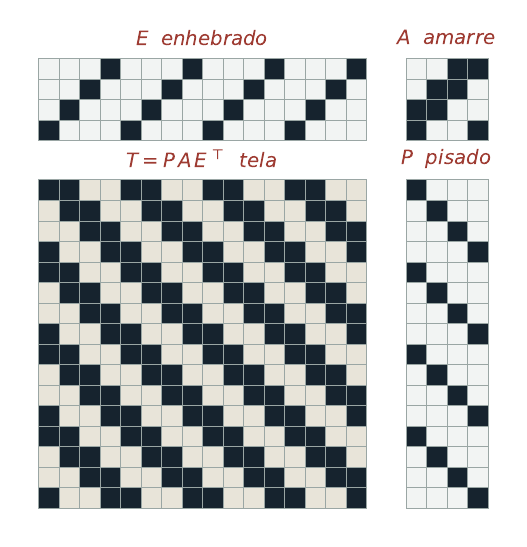

# Telar — editor de diseños para telar de pedal

Un editor de *drafts* para telar de pedal con marcos. Se abre con doble clic en cualquier
navegador, funciona sin conexión y no depende de ningún servidor. Es un solo archivo HTML.

El enhebrado, el amarre y el pisado se pintan arrastrando el cursor; la tela se recalcula al
instante. Guarda y abre archivos en formato WIF, así que puede intercambiar diseños con
cualquier otro programa de tejido.

## Uso

Descarga `telar.html` y ábrelo en un navegador. No hay instalación, no hay dependencias y no
se envía nada a ninguna parte: todo el cálculo ocurre en tu equipo.

- **Enhebrado.** Arrastra sobre la retícula superior izquierda. Cada columna es un hilo de
  urdimbre; cada fila, un marco. Volver a tocar el mismo marco desenhebra el hilo.
- **Amarre.** Retícula superior derecha. Cada columna es un pedal; marca los marcos que levanta.
- **Pisado.** Retícula derecha. Cada fila es una pasada; marca los pedales que se pisan.
- **Color.** Toca las franjas de arriba y de la derecha para teñir hilo por hilo, o usa el
  rayado automático cada *n* hilos.
- **Zoom, deshacer** con Ctrl+Z, y una pestaña de tela repetida para ver el motivo a lo ancho.

Exporta PNG del diseño completo y de la tela repetida, y WIF para intercambio.

## El modelo

Tres matrices sobre el semianillo booleano $\mathbb{B}=(\{0,1\},\vee,\wedge)$ determinan la tela
por completo. Con $n$ hilos de urdimbre, $m$ pasadas, $s$ marcos y $r$ pedales:

| Matriz | Dimensión | Significado |
|---|---|---|
| $E$ enhebrado | $n \times s$ | $E_{i\ell}=1$ si el hilo $i$ pasa por el marco $\ell$, con un solo uno por renglón |
| $A$ amarre | $r \times s$ | $A_{k\ell}=1$ si el pedal $k$ levanta el marco $\ell$ |
| $P$ pisado | $m \times r$ | $P_{jk}=1$ si en la pasada $j$ se pisa el pedal $k$ |

La tela es su producto:

$$T = P\,A\,E^{\top}, \qquad T_{ji}=\bigvee_{k=1}^{r}\bigvee_{\ell=1}^{s} P_{jk}\wedge A_{k\ell}\wedge E_{i\ell}$$

donde el renglón $j$ es la pasada $j$-ésima, la columna $i$ es el hilo de urdimbre $i$-ésimo y
$T_{ji}=1$ indica que ese hilo queda encima en el cruce.

El programa también reporta el **flotante máximo**, calculado de forma cíclica sobre el diseño
porque la tela se repite. Es el criterio que decide en la práctica si una tela se sostiene en
uso: por encima de siete el programa avisa, porque la tela queda floja.

## Estructuras incluidas

Catorce estructuras cargadas, con sus flotantes verificados contra los valores teóricos.

| Estructura | Marcos | Pedales | Flot. urdimbre | Flot. trama |
|---|---|---|---|---|
| Tafetán | 4 | 2 | 1 | 1 |
| Esterilla 2/2 | 4 | 2 | 2 | 2 |
| Sarga 2/2 | 4 | 4 | 2 | 2 |
| Sarga 1/3 | 4 | 4 | 1 | 3 |
| Espiguilla | 4 | 4 | 2 | 3 |
| Punto de rombo | 4 | 4 | 3 | 3 |
| Rosepath | 4 | 6 | 3 | 3 |
| Doble tela | 4 | 4 | 3 | 3 |
| Summer & winter, 2 bloques | 4 | 8 | 3 | 3 |
| Waffle | 5 | 8 | 4 | 7 |
| Sarga 2/2 de 8 | 8 | 8 | 4 | 4 |
| Sarga rota | 8 | 8 | 4 | 4 |
| Satén de 8, paso 3 | 8 | 8 | 1 | 7 |
| Rombo curvo | 8 | 8 | 7 | 7 |

Los casos de referencia son los primeros: el tafetán da flotantes de uno en ambos sentidos, la
esterilla de dos, la sarga 1/3 da uno en urdimbre y tres en trama, y el satén de ocho con paso
tres da uno y siete. Que el cálculo coincida con el valor esperado en cada caso es la
comprobación de que la formulación matricial captura lo que debe capturar.

Los flotantes largos del waffle y del rombo curvo son característicos de esas estructuras y no
un error: el waffle debe su textura precisamente a los flotantes.

## Lo que todavía no hace

Estas ausencias son deliberadas y delimitan el alcance de esta versión.

- No resuelve el **problema inverso**: dada una tela, no calcula una realización con el mínimo
  de marcos y pedales. El mínimo de marcos es el número de columnas distintas de $T$ y se
  calcula en tiempo lineal; el mínimo de pedales es el rango booleano de la matriz de levada,
  que es NP-completo.
- No **verifica cohesión**, es decir, si la tela se sostiene o se separa en piezas al cortarla
  del telar.
- No admite **planes de levada** ni telares de más de dieciséis marcos.
- No incluye **estructuras de encaje** como huck o bronson. Se pueden bajar en WIF de
  handweaving.net y abrirlas aquí.
- No tiene **documentación para quien no sepa ya tejer**.

## Formato WIF

WIF (*Weaving Information File*) es un formato abierto de texto plano. El programa lee y escribe
las secciones `WEAVING`, `WARP`, `WEFT`, `THREADING`, `TIEUP`, `TREADLING`, `COLOR TABLE`,
`WARP COLORS` y `WEFT COLORS`. Nada te ata a este programa: los diseños que hagas aquí se abren
en cualquier otro, y viceversa.

## Cómo citar

> Aguirre Guerrero, D. (2026). *Telar: editor de diseños para telar de pedal* (versión 1.0)
> [Software]. Zenodo. https://doi.org/[DOI]

## Licencia

Los diseños que hagas con este programa son enteramente tuyos. La licencia cubre el programa,
no lo que tejas con él, y no impone ninguna restricción sobre vender lo que produzcas.

## Autoría

Daniela Aguirre Guerrero. Investigadora en teoría algebraica de gráficas y artesana tejedora registrada ante el IFAEM.

---

## English summary

**Telar** is a single-file, offline weaving draft editor for shaft looms, in Spanish. Threading,
tie-up and treadling are painted directly on the grid; the cloth is computed in real time as the
Boolean matrix product $T = P A E^{\top}$ over the Boolean semiring. It reports the longest float
computed cyclically, reads and writes the open WIF format, and ships with fourteen structures
whose float lengths have been verified against their theoretical values. It does not yet solve
the inverse problem, verify hanging-together, or support liftplans. Free software; open the HTML
file in any browser.
